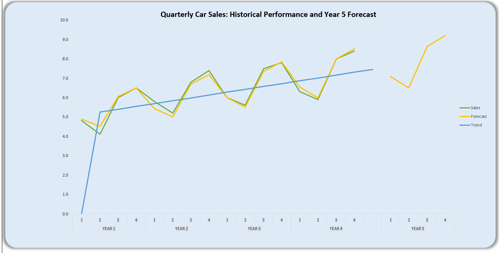
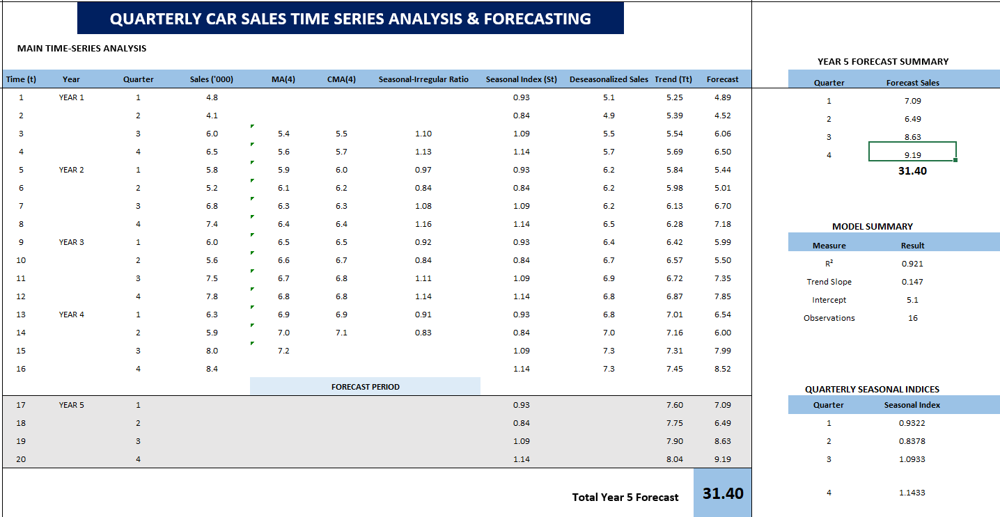

# Quarterly Sales Time Series Forecasting – Excel

## Project Overview

This project demonstrates a complete **quarterly sales time-series analysis and forecasting workflow using Microsoft Excel**.

The analysis examines historical car sales recorded once every quarter. The objective is to understand how sales change over time, identify the underlying **trend, seasonal, and irregular components**, and use these historical patterns to forecast sales for the following year.

The project applies the **classical multiplicative time-series model**:

`Yt = Tt × St × It`

Where:

- **Yt** = Observed Sales
- **Tt** = Trend Component
- **St** = Seasonal Component
- **It** = Irregular Component

The analysis covers **16 historical quarterly observations across four years** and produces forecasts for all four quarters of **Year 5**.

---

## Business Objective

The analysis was developed to answer the following questions:

- How have quarterly sales changed over time?
- Is there a clear long-term sales trend?
- Do some quarters consistently perform better than others?
- What seasonal patterns exist in the historical sales data?
- What does the sales pattern look like after removing seasonality?
- How strong is the underlying trend?
- What sales levels can reasonably be expected during Year 5?

---

## Analysis Preview

### Time Series Analysis and Forecast Summary

The analysis decomposes historical quarterly sales into trend, seasonal, and irregular components.

A **4-quarter moving average** and **centered moving average** were used to estimate the underlying baseline before calculating seasonal indices, deseasonalizing the sales data, and fitting a linear trend model.



### Historical Sales and Year 5 Forecast

The final forecast combines the estimated trend with the quarterly seasonal indices.



---

# Time-Series Analysis Methodology

## Step 1: Visualize the Historical Sales Data

The first step was to plot the original quarterly sales using a **Line Chart with Markers**.

The visualization helps identify three major time-series components:

- **Trend** – the general long-term direction of sales.
- **Seasonality** – patterns that repeat at regular quarterly intervals.
- **Irregularity** – unexpected or random fluctuations not explained by trend or seasonality.

Visualizing the original series provides an initial understanding of sales behaviour before further analysis.

---

## Step 2: Create a Time Variable

A sequential time variable, **t**, was created:

`1, 2, 3, 4, 5, 6, ...`

Each number represents the chronological position of a quarter.

The time variable is later used as the independent variable when estimating the linear sales trend.

---

## Step 3: Calculate the 4-Quarter Moving Average

Because the observations are quarterly, a **4-quarter moving average** was used to smooth short-term fluctuations.

Example Excel formula:

```excel
=AVERAGE(A6:A9)
```
---

## Step 4: Calculate the Centered Moving Average

Since four is an even number, the 4-quarter moving average does not align directly with an individual quarter.

A **Centered Moving Average (CMA)** was therefore calculated.

Example:

```excel
=AVERAGE(F8:F9)
```

Two consecutive moving averages are averaged to position the smoothed value correctly against the original time series.

The CMA represents the approximate **trend-cycle baseline** of the sales series.

---

## Step 5: Estimate the Seasonal-Irregular Component

The original sales value was divided by the centered moving average:

```text
Yt / CMA
```

Under the classical multiplicative time-series model:

```text
Yt = Tt × St × It
```

Where:

- **Yt** = Observed sales
- **Tt** = Trend component
- **St** = Seasonal component
- **It** = Irregular component

Since the centered moving average approximates the underlying trend:

```text
Yt / CMA ≈ St × It
```

For example, a value of:

```text
1.10
```

means that sales during that quarter were approximately **10% above the underlying baseline** because of seasonal and irregular effects.

Similarly, a value below `1.00` indicates that sales were below the baseline.

---

## Step 6: Calculate Quarterly Seasonal Indices

The next step is to estimate the seasonal component **St** while reducing the effect of irregular variation.

Seasonal-irregular ratios belonging to the same quarter across different years are averaged.

Separate seasonal indices are calculated for:

- Quarter 1
- Quarter 2
- Quarter 3
- Quarter 4

This can be calculated using `AVERAGE()` or `AVERAGEIF()`.

Example:

```excel
=AVERAGEIF(Quarter_Range,Quarter_Number,Seasonal_Ratio_Range)
```

The appropriate seasonal index is then assigned to every corresponding quarter.

A lookup function can also be used.

Example:

```excel
=VLOOKUP(C6,Seasonal_Index_Table,2,FALSE)
```

This means that:

- Every Quarter 1 observation receives the Quarter 1 seasonal index.
- Every Quarter 2 observation receives the Quarter 2 seasonal index.
- Every Quarter 3 observation receives the Quarter 3 seasonal index.
- Every Quarter 4 observation receives the Quarter 4 seasonal index.

---

## Quarterly Seasonal Indices

| Quarter | Seasonal Index | Interpretation |
|---|---:|---|
| Q1 | 0.9322 | Below seasonal baseline |
| Q2 | 0.8378 | Weakest seasonal quarter |
| Q3 | 1.0933 | Above seasonal baseline |
| Q4 | 1.1433 | Strongest seasonal quarter |

The seasonal indices reveal a clear quarterly pattern.

Sales tend to perform below the underlying trend during **Q1 and Q2**, while **Q3 and Q4** perform above the seasonal baseline.

**Quarter 4 has the strongest seasonal effect**, while **Quarter 2 has the weakest seasonal effect**.

---

## Step 7: Deseasonalize Sales

The seasonal effect is removed from the observed sales values to obtain the underlying sales movement.

The calculation is:

```text
Deseasonalized Sales = Yt / St
```

Example Excel formula:

```excel
=Observed_Sales/Seasonal_Index
```

Deseasonalized sales provide a clearer view of the underlying sales behaviour without the regular quarterly seasonal fluctuations.

This series is then used to estimate the long-term trend.

---

## Step 8: Estimate the Trend

A **Simple Linear Regression (SLR)** was used to estimate the underlying sales trend.

The regression uses:

- **Dependent Variable (Y):** Deseasonalized Sales
- **Independent Variable (X):** Time `t`

The general trend equation is:

```text
Tt = Intercept + (Slope × t)
```

The estimated trend equation from the analysis is approximately:

```text
Tt = 5.10 + (0.147 × t)
```

This indicates that the underlying sales level has a positive trend over time.

The positive slope of `0.147` means that the deseasonalized sales trend increases by approximately **0.147 units per quarter**.

---

## Model Summary

| Measure | Result |
|---|---:|
| R² | 0.921 |
| Trend Slope | 0.147 |
| Intercept | 5.10 |
| Historical Observations | 16 |

The **R² value of 0.921** indicates that approximately **92.1% of the variation in the deseasonalized historical sales series is explained by the fitted linear trend**.

The positive trend slope also indicates that the underlying sales pattern is increasing over time.

---

## Step 9: Generate the Forecast

After estimating the trend, the seasonal component is reintroduced to produce the final sales forecast.

The forecasting equation is:

```text
Forecast = Tt × St
```

Example Excel formula:

```excel
=Trend*Seasonal_Index
```

The irregular component is not deliberately included in the forecast because irregular movements are unpredictable.

The final forecast therefore combines:

```text
Underlying Trend + Expected Seasonal Effect
```

This produces a more realistic forecast than simply extending the historical sales line into the future.

---

## Step 10: Forecast Year 5

The analysis is extended by adding four future quarterly periods:

```text
Year 5 – Quarter 1
Year 5 – Quarter 2
Year 5 – Quarter 3
Year 5 – Quarter 4
```

The time variable is extended into the new periods.

The regression equation is first used to calculate the future trend:

```text
Tt = 5.10 + (0.147 × t)
```

The appropriate seasonal index is then assigned to each future quarter.

Finally:

```text
Forecast = Tt × St
```

is used to calculate the expected quarterly sales.

---

## Year 5 Forecast Results

| Quarter | Forecast Sales ('000) |
|---|---:|
| Q1 | 7.09 |
| Q2 | 6.49 |
| Q3 | 8.63 |
| Q4 | 9.19 |
| **Total Year 5 Forecast** | **31.40** |

The forecast suggests that **Quarter 4 will record the strongest sales performance**, while **Quarter 2 is expected to remain the weakest seasonal period**.

The total projected sales for Year 5 are approximately:

```text
31.40 ('000)
```

The forecasts also suggest that the positive long-term sales trend observed in the historical data is expected to continue.

---

## Analysis Preview

### Time Series Analysis and Forecast Summary

The complete Excel analysis includes:

- Historical quarterly sales
- 4-quarter moving average
- Centered moving average
- Seasonal-irregular ratios
- Quarterly seasonal indices
- Deseasonalized sales
- Linear trend estimates
- Historical fitted values
- Year 5 forecasts
- Model summary


---

### Historical Sales and Year 5 Forecast

The chart compares historical sales with the fitted trend and projected Year 5 sales.


---

## Time-Series Analysis Workflow

```text
Historical Quarterly Sales
        ↓
Visualize the Sales Pattern
        ↓
Create Time Variable (t)
        ↓
4-Quarter Moving Average
        ↓
Centered Moving Average
        ↓
Seasonal-Irregular Ratio
        ↓
Quarterly Seasonal Indices
        ↓
Deseasonalized Sales
        ↓
Simple Linear Regression
        ↓
Estimate Trend (Tt)
        ↓
Reapply Seasonal Component
        ↓
Forecast = Tt × St
        ↓
Year 5 Quarterly Forecast
```

---

## Key Insights

- Historical quarterly sales demonstrate both **trend and seasonal behaviour**.
- The underlying sales trend increases over time.
- Sales performance is not uniform across all four quarters.
- **Quarter 2** has the weakest seasonal effect.
- **Quarter 4** has the strongest seasonal effect.
- Quarter 1 also performs slightly below the underlying seasonal baseline.
- Quarter 3 performs above the underlying baseline.
- Deseasonalization makes the long-term sales movement easier to identify.
- The fitted linear trend achieved an **R² of approximately 0.921**.
- The positive trend slope of **0.147** indicates continued underlying growth.
- Year 5 sales are forecast to reach approximately **31.40 ('000)** in total.
- Q4 is forecast to achieve the highest Year 5 quarterly sales at approximately **9.19 ('000)**.
- Q2 is forecast to record the lowest Year 5 quarterly sales at approximately **6.49 ('000)**.

---

## Business Interpretation

The analysis shows that management should not evaluate sales performance using the same expectations for every quarter.

The historical seasonal pattern indicates that **Q1 and Q2 tend to perform below the underlying sales trend**, while **Q3 and Q4 typically perform above the trend**.

This means that sales targets, inventory planning, marketing activities, and resource allocation should take seasonal behaviour into consideration.

The stronger seasonal performance observed in Q3 and particularly Q4 may justify increased inventory availability, marketing expenditure, and sales resources during those periods.

The positive underlying trend suggests that sales are generally growing over time.

If the historical pattern continues, management can expect further growth during Year 5 while still experiencing the same quarterly seasonal variations.

---

## Business Value

Time-series forecasting allows businesses to move beyond simply describing historical sales performance and begin using past patterns to support future decisions.

This analysis can support:

- Sales target setting
- Revenue forecasting
- Inventory planning
- Procurement planning
- Budget preparation
- Seasonal marketing campaigns
- Workforce and resource allocation
- Performance benchmarking
- Short-term financial planning
- Identification of strong and weak sales periods

By separating **trend and seasonal effects**, management can develop more realistic quarterly expectations rather than assuming that sales should remain constant throughout the year.

The forecast is limited to **one year ahead** because longer forecasting horizons are increasingly affected by economic conditions, market changes, competition, customer behaviour, and other unforeseen events.

---

## Excel Skills Demonstrated

This project demonstrates practical Excel and analytical skills including:

- Microsoft Excel
- Time-Series Analysis
- Data Visualization
- Excel Formulas
- `AVERAGE()`
- `AVERAGEIF()`
- `VLOOKUP()`
- 4-Quarter Moving Average
- Centered Moving Average
- Classical Time-Series Decomposition
- Seasonal-Irregular Ratio
- Seasonal Index Calculation
- Deseasonalization
- Simple Linear Regression
- Trend Estimation
- Forecasting
- Data Analysis ToolPak
- Regression Statistics
- Forecast Visualization
- Business Interpretation

---

## Tools & Techniques Used

`Microsoft Excel`  
`Time-Series Analysis`  
`Moving Average`  
`Centered Moving Average`  
`Seasonal Decomposition`  
`Deseasonalization`  
`Seasonal Index`  
`Simple Linear Regression`  
`Trend Modelling`  
`Forecasting`  
`Data Visualization`

---

## Repository Structure

```text
Quarterly-Sales-Time-Series-Forecasting-Excel/
│
├── README.md
├── Quarterly_Car_Sales_Time_Series_Analysis_and_Forecasting.xlsx
├── 01_Quarterly_Sales_Time_Series_Forecast.png
└── 02_Quarterly_Sales_Time_Series_Forecast.png
```
---

## Author

**Paul Shir**

Data Analyst | Business Intelligence Developer | Python | SQL | Power BI | Excel | Machine Learning

GitHub: [paul-shir](https://github.com/paul-shir)
